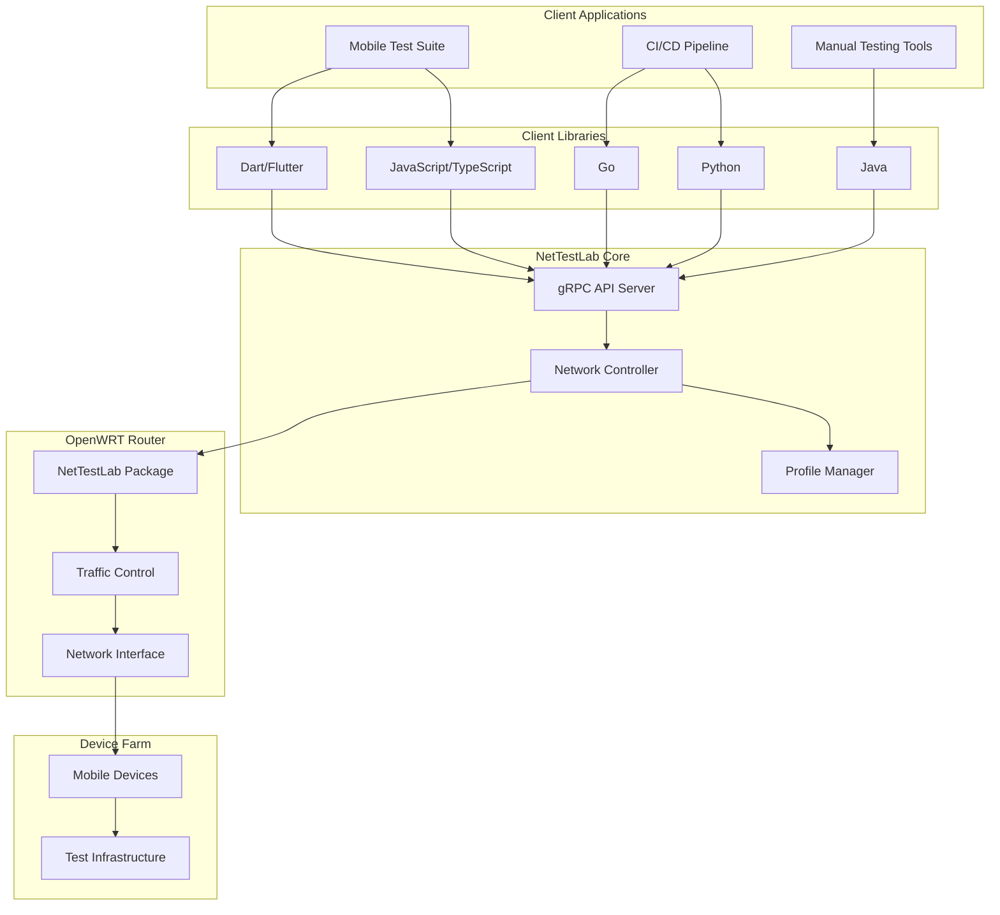
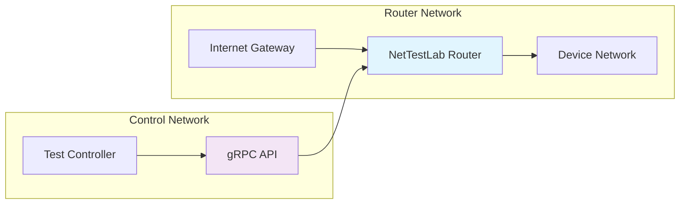

# NetTestLab Architecture

## Overview

NetTestLab is a network simulation platform designed for automated mobile application testing on real device farms. It provides precise control over network conditions (latency, packet loss, bandwidth) through a unified gRPC API.

## System Architecture

## Technology Stack

### Core Components

- **Programming Language**: Go 1.21+
- **API Framework**: gRPC with Protocol Buffers
- **Schema Management**: Buf Build
- **Network Control**: Linux Traffic Control (tc) + NetEm
- **Target Platform**: OpenWRT

### Client Libraries

- **JavaScript/TypeScript**: npm package with TypeScript definitions
- **Python**: PyPI package with type hints
- **Java**: Maven Central artifact
- **Dart/Flutter**: pub.dev package
- **Go**: Go modules

### Infrastructure

- **Documentation**: MkDocs with Material theme
- **CI/CD**: GitHub Actions
- **Package Publishing**: Automated workflows for all package managers

## Core Features

### Network Simulation Capabilities

- **Latency Control**: Configurable network delay (0-5000ms)
- **Packet Loss**: Simulate packet drop rates (0-100%)
- **Bandwidth Limiting**: Control upload/download speeds
- **Jitter Simulation**: Variable delay patterns
- **Network Profiles**: Predefined profiles for 2G, 3G, 4G, 5G networks

### API Functionality

- **Real-time Control**: Apply network conditions instantly
- **Profile Management**: Save and load network condition presets
- **Monitoring**: Query current network state and statistics
- **Batch Operations**: Apply multiple conditions simultaneously

## Network Profiles

| Profile | Bandwidth Down | Bandwidth Up | Latency | Packet Loss |
|---------|---------------|--------------|---------|-------------|
| 2G      | 56 Kbps       | 28 Kbps      | 500ms   | 2%         |
| 3G      | 1.6 Mbps      | 384 Kbps     | 150ms   | 0.5%       |
| 4G      | 50 Mbps       | 10 Mbps      | 50ms    | 0.1%       |
| 5G      | 1 Gbps        | 100 Mbps     | 10ms    | 0.01%      |
| WiFi    | 100 Mbps      | 100 Mbps     | 5ms     | 0%         |

## Deployment Architecture

## Performance Requirements

- **API Response Time**: < 100ms for network changes
- **Throughput**: Support 100+ concurrent device connections
- **Reliability**: 99.9% uptime for test environments
- **Resource Usage**: < 128MB RAM, < 10% CPU on OpenWRT

## Monitoring and Observability

- **Metrics**: Network statistics and API performance
- **Logging**: Structured logging with configurable levels
- **Health Checks**: System status endpoints
- **Alerting**: Configurable notifications for failures
