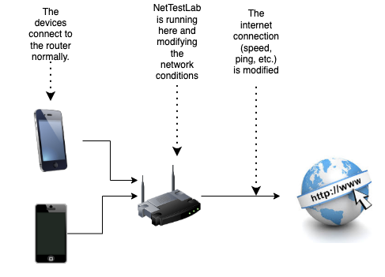

# NetTestLab

[](https://opensource.org/licenses/MIT)
[](https://golang.org)
[](https://openwrt.org)
[](https://grpc.io)

**NetTestLab** is a comprehensive network traffic control system designed for mobile application testing. 

It allows developers and QA engineers to simulate various network conditions (2G, 3G, 4G, etc) directly on OpenWrt routers, providing realistic testing environments for mobile applications.



## ✨ Features

- 🌐 **WiFi Auto-Discovery**: Use `"wifi"` as interface name to automatically target all WiFi interfaces
- 📱 **Mobile Network Simulation**: Pre-configured profiles for 2G, 3G, 4G, 5G, and satellite networks
- 🎛️ **Traffic Control**: Latency, packet loss, bandwidth limiting, jitter, and packet corruption
- 🔧 **OpenWrt Integration**: Native OpenWrt package with proper init scripts and UCI configuration
- 🚀 **gRPC API**: High-performance API with Protocol Buffers
- 📊 **Real-time Monitoring**: System health, interface status, and condition tracking
- 🏗️ **Multi-language Support**: Client libraries for multiple programming languages

## 🏗️ Architecture

```text
┌─────────────────┐    ┌──────────────────┐    ┌─────────────────┐
│   Mobile Apps   │    │   Client Apps    │    │  Web Interface  │
│                 │    │                  │    │                 │
└─────────┬───────┘    └─────────┬────────┘    └─────────┬───────┘
          │                      │                       │
          │              ┌───────▼───────┐               │
          │              │  gRPC Clients │               │
          │              └───────┬───────┘               │
          │                      │                       │
          ▼                      ▼                       ▼
┌─────────────────────────────────────────────────────────────────┐
│                        WiFi Network                             │
│                     (OpenWrt Router)                            │
│                                                                 │
│  ┌─────────────────┐  ┌─────────────────┐  ┌────────────────┐  │
│  │  NetTestLab     │  │  Traffic Control │  │  Interface     │  │
│  │  gRPC Server    │──│  Engine (tc)     │──│  Management    │  │
│  │                 │  │                  │  │                │  │
│  └─────────────────┘  └─────────────────┘  └────────────────┘  │
└─────────────────────────────────────────────────────────────────┘
```

## 🚀 Quick Start

### Prerequisites

- OpenWrt 23.05+ router
- Go 1.21+ (for building from source)
- SSH access to your router

### Install on OpenWrt Router

1. **Download and install the IPK package:**

   ```bash
   # Download the latest release
   wget https://github.com/Eitol/NetTestLab/releases/latest/download/nettestlab_1.0.0_aarch64.ipk
   
   # Install the package
   opkg install nettestlab_1.0.0_aarch64.ipk
   ```

2. **Start the service:**

   ```bash
   /etc/init.d/nettestlab enable
   /etc/init.d/nettestlab start
   ```

3. **Verify installation:**

   ```bash
   /etc/init.d/nettestlab status
   ```

### Basic Usage

#### Using the Command Line Client

```bash
# Build the client
go build -o nettestlab-client cmd/client/main.go

# Test system status
./nettestlab-client -server your-router-ip:8080

# Apply 3G conditions to WiFi interfaces
grpcurl -plaintext -d '{
  "interface": "wifi",
  "conditions": {
    "latency": {"delay_ms": 150, "enabled": true},
    "packet_loss": {"percentage": 2.0, "enabled": true},
    "bandwidth": {"download_bps": 384000, "upload_bps": 128000, "enabled": true}
  }
}' your-router-ip:8080 nettestlab.v1.NetworkControlService/ApplyNetworkConditions

# Reset conditions
grpcurl -plaintext -d '{"interface": "wifi"}' your-router-ip:8080 nettestlab.v1.NetworkControlService/ResetNetworkConditions
```

#### Network Profiles

NetTestLab comes with pre-configured network profiles:

| Profile | Latency | Packet Loss | Download | Upload | Description |
|---------|---------|-------------|----------|--------|-------------|
| **2G** | 300ms | 5% | 56 kbps | 28 kbps | Slow 2G network |
| **3G** | 150ms | 2% | 384 kbps | 128 kbps | Standard 3G network |
| **4G** | 50ms | 0.5% | 10 Mbps | 5 Mbps | Good LTE network |
| **5G** | 10ms | 0.1% | 100 Mbps | 50 Mbps | 5G network |
| **WiFi** | 20ms | 0.1% | 50 Mbps | 50 Mbps | Typical WiFi |
| **Satellite** | 600ms | 1% | 1 Mbps | 256 kbps | Satellite internet |

## 📖 Documentation

### API Reference

The gRPC API provides three main services:

#### NetworkControlService

- `ApplyNetworkConditions`: Apply traffic control conditions to interfaces
- `ResetNetworkConditions`: Remove all conditions from interfaces
- `GetNetworkConditions`: Get current conditions for an interface
- `GetSystemStatus`: Get system information and interface list

#### ProfileService

- `ListProfiles`: Get available network profiles
- `GetProfile`: Get specific profile details
- `ApplyProfile`: Apply a profile to an interface

#### MonitoringService

- `GetHealth`: Get system health status
- `GetMetrics`: Get performance metrics
- `StreamMetrics`: Stream real-time metrics

### Configuration

#### UCI Configuration (`/etc/config/nettestlab`)

```bash
config nettestlab 'main'
    option enabled '1'
    option port '8080'
    option host '0.0.0.0'
    # Optional: specify interfaces to monitor
    # list interfaces 'wl1-ap0'
    # list interfaces 'br-lan'
```

#### Service Management

```bash
# Start/stop/restart service
/etc/init.d/nettestlab start
/etc/init.d/nettestlab stop
/etc/init.d/nettestlab restart

# Check status
/etc/init.d/nettestlab status

# View logs
logread | grep nettestlab
```

#### Data Persistence

NetTestLab uses a file-based profile system for maximum flexibility:

- **Profile Storage**: Each network profile is stored as an individual JSON file in `./data/profiles/`
- **Built-in Profiles**: Default profiles (2G, 3G, 4G, 5G, WiFi, Satellite) are created automatically on first run
- **File Naming**: Profile files are named using the profile name (e.g., `4g.json`, `wifi.json`, `custom-profile.json`)
- **Editable Built-ins**: Built-in profiles can be modified or even deleted since they're stored as regular files
- **Custom Profiles**: User-created profiles are automatically saved and persisted
- **Manual Editing**: Profiles can be manually edited by modifying the JSON files directly
- **Auto-reload**: Changes to profile files are loaded when the service starts

**Profile File Structure:**

```json
{
  "name": "custom_profile",
  "displayName": "Custom Network Profile",
  "description": "Description of the network conditions",
  "type": "PROFILE_TYPE_CUSTOM",
  "builtIn": false,
  "tags": ["custom", "testing"],
  "conditions": {
    "latency": {
      "delayMs": 100,
      "enabled": true
    },
    "packetLoss": {
      "percentage": 1.0,
      "enabled": true,
      "pattern": "LOSS_PATTERN_RANDOM"
    },
    "bandwidth": {
      "downloadBps": 10000000,
      "uploadBps": 5000000,
      "enabled": true
    }
  }
}
```

The server automatically creates the data directory if it doesn't exist and handles profile loading/saving transparently.

## 🛠️ Development

### Building from Source

1. **Clone the repository:**

   ```bash
   git clone https://github.com/Eitol/NetTestLab.git
   cd NetTestLab
   ```

2. **Install dependencies:**

   ```bash
   go mod download
   ```

3. **Generate Protocol Buffers:**

   ```bash
   buf generate
   ```

4. **Build for OpenWrt (ARM64):**

   ```bash
   CGO_ENABLED=0 GOOS=linux GOARCH=arm64 go build -o bin/nettestlab-arm64 cmd/server/main.go
   ```

5. **Build OpenWrt package:**

   ```bash
   ./scripts/build-openwrt-package.sh
   ```

### Project Structure

```text
nettestlab/
├── api/                    # Generated gRPC client libraries
├── clients/               # Client examples and libraries
├── cmd/                   # Main applications
│   ├── server/           # gRPC server
│   ├── client/           # Command-line client
│   └── wifi-test/        # WiFi testing utilities
├── docs/                  # Documentation
├── internal/              # Internal Go packages
│   ├── network/          # Network control logic
│   ├── profiles/         # Network profile management
│   └── server/           # gRPC service implementations
├── openwrt/              # OpenWrt package files
│   ├── Makefile          # OpenWrt package definition
│   └── files/            # Package files and scripts
├── proto/                # Protocol Buffer definitions
├── scripts/              # Build and deployment scripts
└── README.md
```

### Running Tests

```bash
# Run unit tests
go test ./...

# Run integration tests (requires OpenWrt router)
go test -tags=integration ./tests/...

# Test WiFi functionality
go run cmd/wifi-test/main.go -server your-router-ip:8080
```

## 🌐 Client Libraries

NetTestLab provides client libraries for multiple programming languages:

- **Go**: Native gRPC client
- **JavaScript/TypeScript**: npm package
- **Python**: PyPI package
- **Java**: Maven package
- **Dart/Flutter**: pub.dev package

### Example Usage

#### JavaScript/TypeScript

```javascript
import { NetTestLabClient } from '@nettestlab/client';

const client = new NetTestLabClient('http://your-router-ip:8080');

// Apply 3G conditions to WiFi
await client.applyConditions('wifi', {
  latency: { delayMs: 150, enabled: true },
  packetLoss: { percentage: 2.0, enabled: true }
});
```

#### Python

```python
from nettestlab import NetTestLabClient

client = NetTestLabClient('your-router-ip:8080')

# Apply 4G profile
client.apply_profile('wifi', '4g')
```

## 🤝 Contributing

We welcome contributions! Please see our [Contributing Guide](CONTRIBUTING.md) for details.

### Development Setup

1. Fork the repository
2. Create a feature branch: `git checkout -b feature-name`
3. Make your changes and add tests
4. Run tests: `go test ./...`
5. Submit a pull request

### Code Standards

- Follow Go conventions and use `gofmt`
- Add tests for new functionality
- Update documentation for API changes
- Use conventional commits for commit messages

## 📋 Requirements

### System Requirements

- **Router**: OpenWrt 23.05+ with ARM64 or x86_64 architecture
- **Memory**: Minimum 64MB RAM available
- **Storage**: 10MB free space for installation
- **Network**: Kernel modules: `kmod-sched-core`, `kmod-ifb`, `kmod-netem`

### Dependencies

The OpenWrt package automatically installs required dependencies:

- `tc-bpf`: Traffic control tools
- `kmod-sched-core`: Core traffic scheduling
- `kmod-ifb`: Intermediate functional block device
- `kmod-netem`: Network emulation

## 🔧 Troubleshooting

### Common Issues

1. **Service won't start:**

   ```bash
   # Check logs
   logread | grep nettestlab
   
   # Verify dependencies
   opkg list-installed | grep -E "(tc-|kmod-)"
   ```

2. **Cannot apply conditions:**

   ```bash
   # Check if tc is working
   tc qdisc show
   
   # Verify interface exists
   ip link show
   ```

3. **WiFi auto-discovery not working:**

   ```bash
   # List wireless interfaces
   iwconfig
   
   # Check interface status
   ip link show | grep wl
   ```

### Performance Considerations

- Traffic control adds minimal CPU overhead (~1-2%)
- Memory usage: ~10-20MB depending on active conditions
- Network latency: <1ms additional overhead

## 📜 License

This project is licensed under the MIT License - see the [LICENSE](LICENSE) file for details.

## 🙏 Acknowledgments

- OpenWrt team for the excellent router firmware
- gRPC team for the high-performance RPC framework
- Linux kernel developers for traffic control capabilities

## 📞 Support

- **Documentation**: [docs/](docs/)
- **Issues**: [GitHub Issues](https://github.com/Eitol/NetTestLab/issues)
- **Discussions**: [GitHub Discussions](https://github.com/Eitol/NetTestLab/discussions)

---

Made with ❤️ for mobile app developers and QA engineers who need realistic network testing environments.
