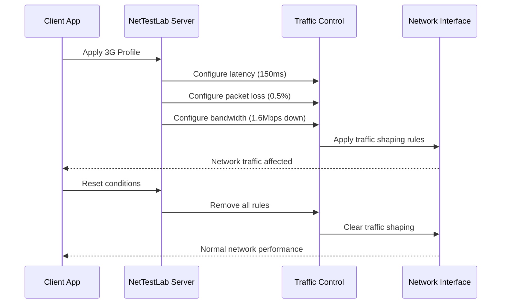

# Overview

Welcome to NetTestLab! This section will guide you through everything you need to know to get started with NetTestLab for network simulation and mobile application testing.

## What is NetTestLab?

NetTestLab is a comprehensive network traffic control system that runs on OpenWrt routers. It allows you to simulate various network conditions in real-time, making it perfect for:

- **Mobile application testing** under different network scenarios
- **API resilience testing** with high latency and packet loss
- **Progressive loading behavior** testing with bandwidth limits
- **Offline functionality** testing with complete network cuts
- **Performance optimization** by identifying network bottlenecks

## How It Works

NetTestLab consists of three main components:

### 1. gRPC Server (Router)
Runs on your OpenWrt router and controls the network traffic using Linux Traffic Control (`tc`) commands.

### 2. Client Libraries
Available for multiple programming languages to interact with the gRPC server:
- Go
- JavaScript/TypeScript
- Python  
- Java
- Dart/Flutter

### 3. Network Profiles
Predefined or custom network condition sets that can be applied instantly:
- **2G Mobile**: High latency (500ms), low bandwidth (56Kbps down, 28Kbps up)
- **3G Mobile**: Moderate latency (150ms), medium bandwidth (1.6Mbps down, 384Kbps up)
- **4G/LTE**: Low latency (50ms), high bandwidth (50Mbps down, 10Mbps up)
- **5G**: Very low latency (10ms), very high bandwidth (1Gbps down, 100Mbps up)
- **WiFi**: Low latency (5ms), high bandwidth (100Mbps symmetric)
- **Satellite**: Very high latency (600ms), variable bandwidth with jitter

## System Requirements

### Router Requirements
- **OpenWrt 23.05+** with ARM64 or x86_64 architecture
- **Minimum 64MB RAM** available for NetTestLab
- **10MB storage** space for the package
- **Kernel modules**: `kmod-sched-core`, `kmod-ifb`, `kmod-netem`

### Client Requirements
- **Network access** to the router's IP address
- **gRPC support** in your development environment
- **Appropriate client library** for your programming language

## Next Steps

Choose your path to get started:

1. **[Installation →](installation.md)** - Install NetTestLab on your OpenWrt router
2. **[Quick Start →](quickstart.md)** - Get up and running in 5 minutes
3. **[Configuration →](configuration.md)** - Detailed configuration options

## Architecture Overview

## Key Concepts

### Network Conditions
Individual aspects of network performance that can be controlled:

- **Latency**: Round-trip delay for packets
- **Packet Loss**: Percentage of packets that are dropped
- **Bandwidth**: Maximum data transfer rate (upload/download)
- **Jitter**: Variation in packet arrival times
- **Corruption**: Introduce bit errors in packets

### Profiles
Named collections of network conditions that represent real-world scenarios. Profiles can be:

- **Built-in**: Predefined profiles based on real network measurements
- **Custom**: User-defined profiles for specific testing scenarios

### WiFi Auto-Discovery
A special feature that automatically applies conditions to all WiFi interfaces without requiring manual interface specification. Simply use `"wifi"` as the interface name.

---

Ready to install? Let's [get started with installation →](installation.md)